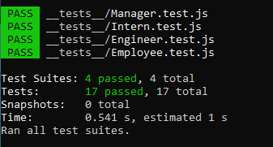
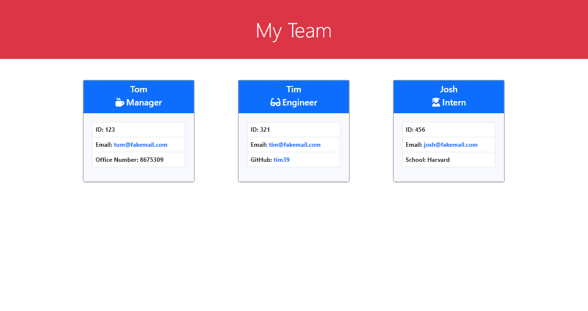

# Team Generator
Developing a generator the creates employee team information.

# Pseudo Code

* Build a Node.js command-line application that takes in information about employees on a software engineering team, then generates an HTML webpage that displays summaries for each person.
* Write a unit test for every part of your code and ensure that it passes each test.
* Generate a webpage that displays team's basic info that I have quick access to their emails and GitHub profiles
* WHEN prompted for team members and their information, an HTML file is generated that displays formatted team roster based on user input
* WHEN an email address in the HTML is clicked on, then the default email program opens and populates the TO field of the email with the address
* WHEN the GitHub username is clicked on, then that GitHub profile opens in a new tab
* WHEN the application is started, THEN a prompt to enter the team manager’s name, employee ID, email address, and office number is given
* WHEN the team manager’s name, employee ID, email address, and office number ar entered, then a menu with the option to add an engineer or an intern or to finish building my team is presented.
* WHEN the engineer option is selected, THEN a prompt to enter the engineer’s name, ID, email, and GitHub username is given, and redirected back to the menu
* WHEN the intern option is selected, THEN a prompt to enter the intern’s name, ID, email, and school is given, and redirected back to the menu
* WHEN finishing the building of the team, THEN the application is exited, and the HTML is generated
* The application should use Jest and Inquirer

# Demonstration

# Video Download

[Team Generator Demo](./assets/team_generator_demo.mp4)

# Screenshots

